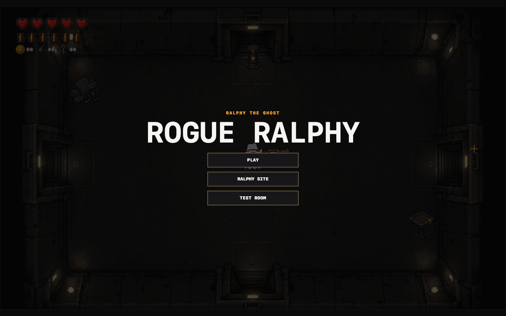
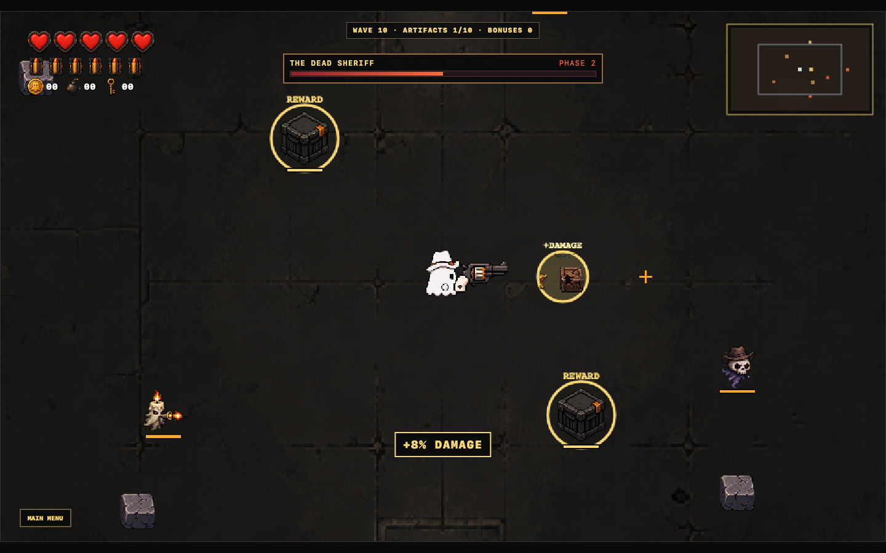
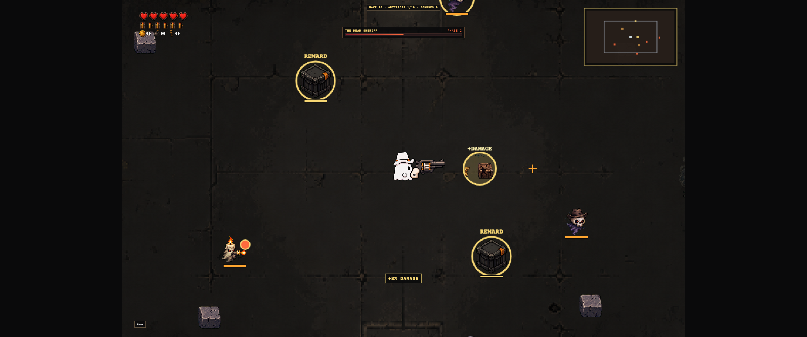

# 👻 ROGUE RALPHY

**A haunted pixel-Western arena roguelite starring Ralphy the Ghost.**

Build impossible revolver combos. Outrun the dead. Send the Sheriff back to his grave.

[**▶ PLAY IN BROWSER**](https://alecs5am.github.io/Rogue-Ralphy/) · [**🧪 COMBAT LAB**](https://alecs5am.github.io/Rogue-Ralphy/?fixture=lab) · [**MEET RALPHY**](https://www.alecs5am.com/ralphy)

## One ghost. Six rounds. Thirty-six ways to break the rules.

Rogue Ralphy is a browser-based arena roguelite about a cowboy ghost, a six-shot revolver, and artifacts that refuse to behave alone. Every run is ten escalating waves: choose one of two artifacts, hunt timed bonus enemies, collect permanent stat pickups, and survive the multi-phase **Dead Sheriff** showdown.

- **36 unique artifacts** — homing shots, Tesla arcs, spectral penetration, orbiting bullets, ricochets, status effects, echoes, summons, and stranger combinations.
- **Stack everything** — artifacts are one-of-a-kind, but their effects compose into increasingly ridiculous projectile builds.
- **Enemies with a plan** — snipers, bombers, splitters, healers, summoners, rushers, and ranged attackers force you to keep moving.
- **Risk and reward** — destructible cover, timed loot targets, reward crates, health drops, and permanent run upgrades.
- **A full combat laboratory** — equip any artifact combination, spawn targets, and inspect live DPS and weapon telemetry.

## Build something haunted

  

<em>The tenth wave ends with the Dead Sheriff — phases, bullet patterns, reinforcements, and all.</em>

  

## Controls

| Action | Control |
| --- | --- |
| Move | **W A S D** |
| Aim | **Mouse** |
| Fire | **Left mouse button** |
| Reload / active reload | **R** |
| Pause / run menu | **Esc** |

The revolver reloads automatically when empty. With the right artifact, pressing **R** again inside the highlighted timing window triggers a perfect reload and a temporary buff.

## Run locally

Requires [Bun](https://bun.sh/).

    bun install
    bun run dev

Then open http://127.0.0.1:5173/.

    bun run test
    bun run build
    bun run test:e2e

## Built for the jam

Rogue Ralphy is a game-jam demo built for OpenAI Build Week with TypeScript, Canvas 2D, Vite, Bun, Playwright, and a large stack of generated pixel-art assets.

[Play Rogue Ralphy](https://alecs5am.github.io/Rogue-Ralphy/) · [Ralphy on alecs5am.com](https://www.alecs5am.com/ralphy) · [Source on GitHub](https://github.com/alecs5am/Rogue-Ralphy)

**Stay spooky, cowboy.**

